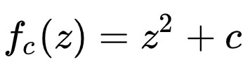
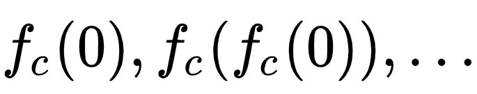

# Fractals

Playing with fractals in different programming languages

## Install dependencies

### python
`pip install -r requirements.txt`

### js
`npm i`

## Mandelbrot
Is the set of complex numbers for which the function  does not diverge when iterated from z=0; for which  sequence remains bounded in absolute value.\

For better understanding, visit [this link](https://www.youtube.com/watch?v=MwjsO6aniig)